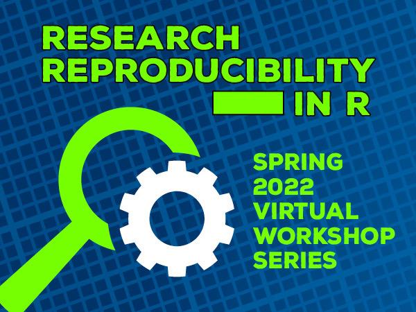

  

Welcome to the Research Reproducibility in R Workshop supported by the Penn State Libraries!

This series will offer hands-on training in fundamental coding skills, statistical data analysis, data visualization and data management strategies to support research reproducibility. Participants can expect to learn how to wrangle data into an analysis-ready format, use R packages and connections to manage projects, use the ggplot2 package to create data visualizations, and implement statistical analyses to understand trends and differences in data.

The workshops are open to Penn State graduate students, postdoctoral scholars, staff and faculty. No previous knowledge of R is required.

**Schedule**

| Session | Date | Time |
| ------- | ---- | ---- |
| <a href="#Basics">Basics of R and RStudio</a> | Monday, March 21 | 1–2 p.m. |
| <a href="#Wrangling">Data Wrangling</a> | Wednesday, March 23 | 1–3 p.m. |
| <a href="#Management">Data Management and Research Reproducibility </a> | Wednesday, March 30 | 1–3 p.m. |
| <a href="#Visualization">Data Visualization </a> | Wednesday, April 6 | 1–3 p.m. |
| <a href="#Statistical">Statistical Data Analysis</a> | Wednesday, April 13 | 1–3 p.m. |
| <a href="#Bring">Bring Your Data Day!</a> | Wednesday, April 20 | TBD |

**Organizers**
 

[Briana Ezray Wham](https://libraries.psu.edu/directory/bde125) 
Research Data Librarian - STEM 
 
  

[Jennifer Valcin](https://libraries.psu.edu/directory/jpv5319) 
Statistical Data Analyst 
 
  

[Tyler Bruce Garner](https://libraries.psu.edu/directory/tbg5023) 
Graduate Assistant - Statistical Data Analysis Consultant 
 

**Resources**

- [Data sets]()
- [Code]()
- [Slides]()
- [Recordings]()

[Schedule an Appointment for Office Hours](https://outlook.office365.com/owa/calendar/RWorkshopSeriesOfficeHours@PennStateOffice365.onmicrosoft.com/bookings/s/hmg205E8LUKdnPoi-BVCGA2)

### Basics of R and RStudio

In this optional indroductory session we will:

- Install and introduce R and RStudio
- Walk through the RStudio integrated development environment (IDE)
- Discuss the utility of using R for reproducible research

<h4><a href="#Top">Top</a></h4>

### Data Wrangling

This overview of data wrangling will overview the basics of RStudio and introduce the tidyverse to show you how to:

- Use basic indexing and functions, such as setting a working directory and loading data and packages
- Wrangle (manage, clean, and transform) data into tidy format or to create new variables
- Handle string and date/time data
- Find resources to support the analysis you would like to conduct

<h4><a href="#Top">Top</a></h4>

### Data Management and Research Reproducibility

In this session  you will be provided an overview of data management strategies for a reproducible analysis and output workflow to facilitate transparent and reproducible research to support open data sharing. Topics include:

- Best practices for code documentation, file organization, naming, and versioning
- How to connect RStudio to Git and GitHub
- How to implement a reproducible, project-based data analysis and output workflow                                                                           
- How to document data exploration, analysis and visualization in publishable documents using RMarkdown

Additionally, data management and reproducibility strategies from the previous sessions will be applied to the R workflow.

### Data Visualization

This session focuses on data communication. Because sharing research results is a critical step in any research project, effective communication is vital. Tools such as RMarkdown and ggplot2 can be used to document data exploration, analysis and visualization steps and create meaningful data visualizations. This workshop will show you how to:

- Identify the traits of effective data visualizations
- Use ggplot2 to create numerous types of plots and perfect them iteratively

Participants will use their reproducible, project-based data analysis workflow to apply data wrangling tasks learned in previous sessions to prepare data and create visualizations.

### Statistical Data Analysis

Implementing statistical analyses to understand trends and differences in data is an important tool for effective research communication. This workshop will cover exploratory data analysis, including methods for testing hypotheses, computing confidence intervals and reporting results. Participants will test and apply their R programming skills to basic data analyses.

Methods that will be covered include:

- Parametric tests (t-test and ANOVA)
- Non-parametric tests (Kruskal-Wallis and Chi-square)
- Linear regression
- Survey Analysis

### Bring Your Data Day!

Workshop participants will have a chance to meet with the instructors and put their new skills to use by applying them to their own data.
